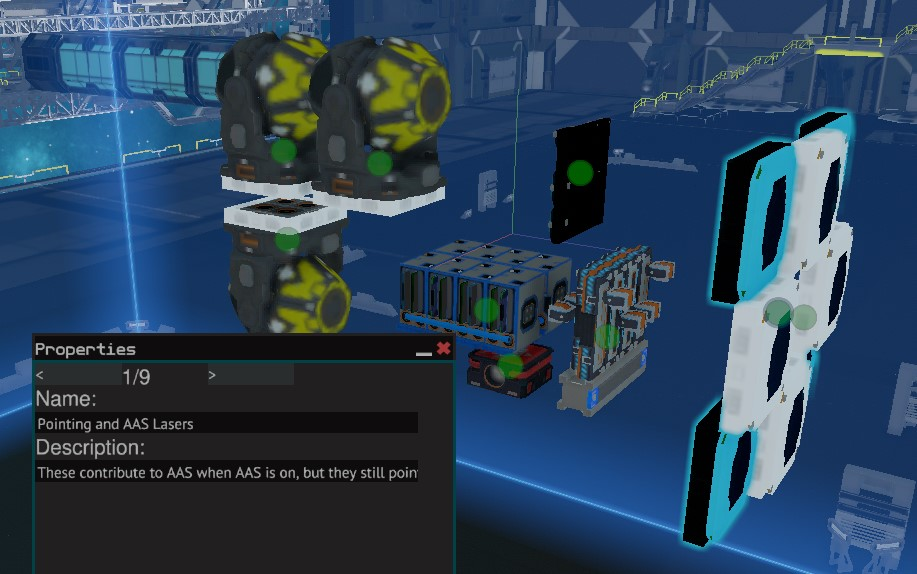

# Nav-Suite
An integration and minor tweaking of Archaegeo's Waypointing, Firestar99's Compass, FixerID's Autopilot, my own asteroid avoidance and a couple utility scrips that I place pretty regularly.

The majority of this work is originally done by the authors posted above. Here are links to their original projects but do note that they are not obligated to help you figure out how this version works. These are here for reference and comparison.

https://gitlab.com/Firestar99/yolol/-/blob/master/src/compass/README.md

https://github.com/Archaegeo/Starbase/tree/main/ISAN-Waypoint%20System

https://github.com/fixerid/sb-projects/tree/main/NavCas

https://gitlab.com/Whitestrake/yolol

How to install: Download the .fbe and turn it into a module. Paste the module in your ship blueprint. Put chips in slots, attach buttons, place receivers in downward L pattern as referenced in FixerID's wiki. Ensure your FCU, binds, and levers use the 3 letter standard in the example FCU. Set FWD lever re-center field to CRUS. Make sure things are named appropriately as per the .fbe. A list of all global variables used is avaiable, but may not be complete. Tune the autopilot as per navCas wiki. A more in-depth guide on tuning my changes is in the faq. Copy the rangefiders as many times as you need to cover your ship. Use the top one for the top parts etc.

How to use: Stop the ship. Enter a waypoint either by saving and/or selecting it then Loading it via Archageos Waypointing system. Press nav to go there or point at it manually with compass and go yourself.

FAQ: https://github.com/Thaccus/Starbase-Nav-Suite/wiki

My question isn't in the faq. What do?

 Contact me here, on reddit /u/Thaccus, or on discord Thaccus#0591(Make sure you are in one of the Starbase/SSS/Cylon discords or friend me to message me.)
