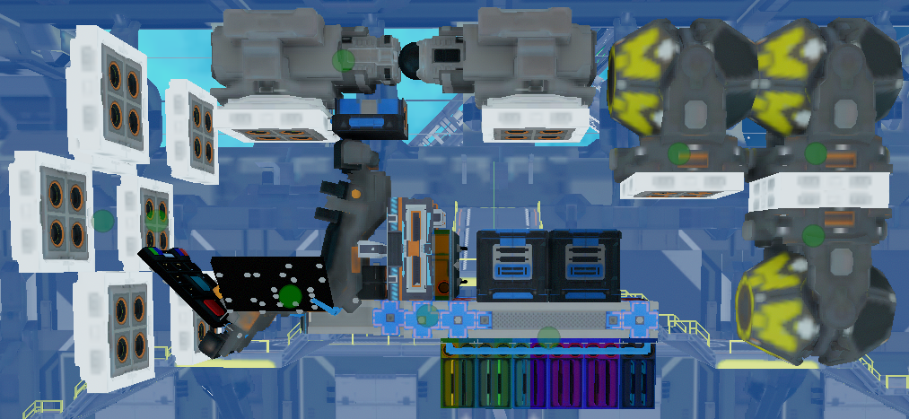

# Nav-Suite
An integration and minor tweaking of Archaegeo's Waypointing, Firestar99's Compass(Using Collective's ISAN), FixerID's Autopilot, DarkyShadow's approach, HappyTrigger's autonomy calculator, and my own asteroid avoidance, vectored speedometer, anti-drift system, and inertial navigation framework.

The majority of this work is originally done by the authors posted above. I just made them all play nice together and re-did some math so they all used the same receivers. Here are links to their original projects but do note that they are not obligated to help you figure out how this version works. These are here for reference and comparison.

[Firestar99](https://gitlab.com/Firestar99/yolol/-/blob/master/src/compass/README.md)   [Archaegeo](https://github.com/Archaegeo/Starbase/tree/main/ISAN-Waypoint%20System)   [FixerID](https://github.com/fixerid/sb-projects/tree/main/NavCas)   [DarkyShadow](https://github.com/GameName-Darkyshadow/Starbase)   [CollectiveISAN](https://github.com/Collective-SB/ISAN) [HappyTrigger](https://discord.gg/zFRdPBa2)

### How to install:
Download the file (named NavSuite_Bas#.fbe NavSuite_Adv#.fbe depending on which version you want) and copy it into your blueprint. Place the parts on your ship and make sure to read the module descriptions(not just the names). Place brain box, chair, and sensor cluster on ship respecting their orientation. Place receivers in downward L pattern as referenced in FixerID's or my wiki and as they are oriented in the suite. Ensure your FCU, batteries, tanks, fuelchambers, and levers use the same values as the included examples. Make sure things are named appropriately as per the .fbe and do not collide with whatever else you have on your ship. A list of all global variables used is available[ here,](https://github.com/Thaccus/Starbase-Nav-Suite/blob/main/UsedGlobalVars.txt) but may not be complete. Tune the autopilot as per the[ FAQ/Wiki.](https://github.com/Thaccus/Starbase-Nav-Suite/wiki/Installation-(Looking-for-contributors)) Copy the rangefinders as many times as you need to cover your ship (Use the top one for the top parts etc) and be sure to include at least the top "pointing" lasers as they are used for approach. The [ships](https://github.com/Thaccus/Starbase-Nav-Suite/tree/main/Ships) folder has some examples of ships using the suite to download if anything is unclear.

### How to use:
Stop the ship. Enter a waypoint either by saving and/or selecting it then Loading it via Archageo’s Waypointing system. Press nav to go there or point at it manually with compass and go yourself. Asteroid avoidance will turn on, but you can turn it on yourself if you just want to cruise somewhere without waypoints.

### [FAQ/Wiki is located here](https://github.com/Thaccus/Starbase-Nav-Suite/wiki/F.A.Q.)
This contains documentation about using, installing, and troubleshooting various parts of the system. I can't know what people struggle with unless they tell me. Feel free to suggest topics or contribute them directly to the wiki.

### My question isn't in the faq/wiki. What do?
Contact me here, on reddit /u/Thaccus, or on discord @Thaccus (Make sure you are in one of the Starbase/SSS/Cylon discords or friend me to message me.)
