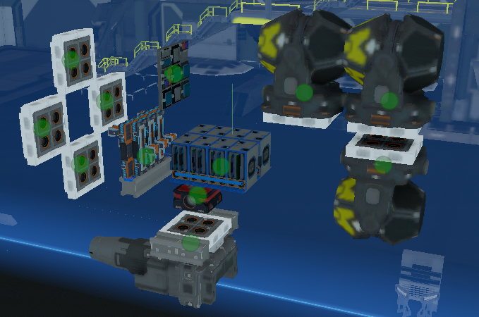

# Nav-Suite
An integration and minor tweaking of Archaegeo's Waypointing, Firestar99's Compass, FixerID's Autopilot, my own asteroid avoidance and a couple utility scrips that I place pretty regularly.

The majority of this work is originally done by the authors posted above. Here are links to their original projects but do note that they are not obligated to help you figure out how this version works. These are here for reference and comparison.

https://gitlab.com/Firestar99/yolol/-/blob/master/src/compass/README.md

https://github.com/Archaegeo/Starbase/tree/main/ISAN-Waypoint%20System

https://github.com/fixerid/sb-projects/tree/main/NavCas

https://gitlab.com/Whitestrake/yolol

How to install: Download the .fbe and turn it into a module. Paste the module in your ship blueprint. Put chips in slots, attach buttons, place receivers in downward L pattern as referenced in FixerID's wiki. Ensure your FCU, binds, and levers use the 3 letter standard in the example FCU. Set FWD lever re-center field to CRUS. Make sure things are named appropriately as per the .fbe. A list of all global variables used is avaiable, but may not be complete. Tune the autopilot as per navCas wiki. A more in-depth guide on tuning my changes is in the faq. Copy the rangefiders as many times as you need to cover your ship. Use the top one for the top parts etc.

How to use: Stop the ship. Enter a waypoint either by saving and/or selecting it then Loading it via Archageos Waypointing system. Press nav to go there or point at it manually with compass and go yourself.

FAQ: 

 My auto pilot is dumb and won't align! How do I tune it to be smarter?
 
 There are five tunables: PT(pitch target), YT(yaw target), RT(roll target), L(aiming precision), and chill(wait time). Ideally you want PT and YT to be a value that will turn you ~30 degrees on an instant input. They will be multiplied by how close you are to proper alignment and if they arent large enough you may never reach your desired aiming precision. If you have recenter at 100 and pt/yt100 aren't enough(big ship/low thrust problems), you may have to settle for lowering the recenter value on your levers 50/33/25/20/10/5 will extend the burn but you will need to wait for them to end(see chill). Roll just does minor error correction so 10 degrees is more than enough(a value of 1 was plenty for my small testbed). L Determines the level of accuracy the heading must be for nav to start moving. L values that are too small may never be reached depending on how small a movement you can get out of your thruster tuning. Chill is an important factor for ship operation. It is important that the ship come to a full rotational stop before asking it where it is going again. ISAN is most accurate when still and you are likely trying to point at something far away. If your ship is large, increase chill until there is at least .4s of stopped rotation between each alignment burn. I know the watiting hurts, but trust me that it is faster and more accurate to have a bit of chill.
 
 I don't want to redo my binds! Can you make a version that uses standard binds?
 
 No, join my fucking religion. For real though: The small bind names help with shoving more behavior into fewer lines of code. That makes it easier on me, faster for you, and ensures that my company can all pass ships around and code for them without running into weirdness. Also I like using c-Key for turret shenanigans/strafing and I don't want other things playing with FcuRotationalPitch/Yaw. I have had some people tell me they have this set up as FcuMfcIO2 so...maybe give that a go if you want. Just make sure you still set up levers for those binds as they need to automatically re-center.

 I can't get X to work in combination with your system. What am I doing wrong?
 
 Integration hell is real and you have just stepped into it. Welcome :) I have provided a list of all global variables and what they are used for in UsedGlobalVars.txt Ensure you are not overlapping unintentionally, then trace each variable you intentionally overlap though the chips to understand them.
 
  Where quad?
 
  This sytem was meant to be apporachable for people just getting into the game with little to no shipwrighting or coding chops. A quad version with chip execution queing and fast vectors is coming SOONtm. Beware: It will not be as simple to set up and will eat YOLOLchips like candy.

My question isnt in the faq. What do?

 Contact me here, on reddit /u/Thaccus, or on discord Thaccus#0591(Make sure you are in one of the Starbase/SSS/Cylon discords or friend me to message me.)
