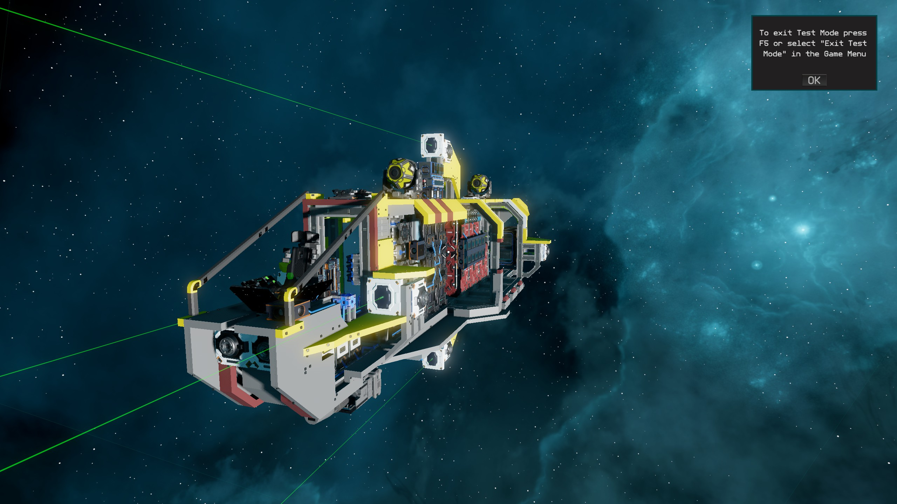
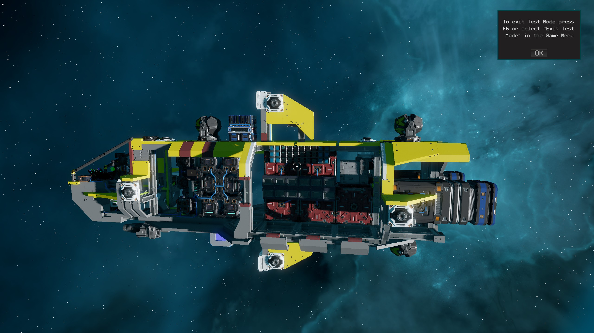

# Ships
## Example Ship
Original ship created by Taccus

## Science Laborer
Original ship created by Frozenbyte
Edited by Peacefighter1996

Modified as an introduction ship to the nav suite.
Uses the advanced nav suite and its own PD controlled Generator Regulator script.

Open Update:

- [ ] Set up align rotation values.
- [ ] Check if isan is working ouside design.
- [ ] Chronometer display in the cockpit.
 

